# Team Task Manager

A full-stack **Team Task Management System** built as a practical learning project using **Next.js, Node.js, Express.js, MongoDB, JWT, Tailwind CSS, and Socket.IO**.

The application provides separate **Manager** and **Employee** portals. Managers can manage employees and assign tasks, while employees can view assigned tasks and update their status. Socket.IO keeps important task changes synchronized in real time.

---

## Features

### Manager

- Manager authentication
- Dashboard with employee and task statistics
- Employee CRUD
- Create and assign tasks to employees
- Task list with employee/date filters
- Pagination
- View, edit and delete tasks
- Reassign/update tasks
- Realtime employee task-status updates
- Realtime dashboard counts
- Notification bell with read/unread state
- Toast notifications

### Employee

- Employee authentication
- Dashboard with task status counts
- View assigned tasks
- Filter tasks by priority/status
- Tasks sorted by due date and priority
- View task details
- Update task status:
  - Pending
  - Working
  - Hold
  - Completed
- Confirmation before status update
- Realtime notification when a manager assigns a task
- Realtime dashboard/task-list updates
- Notification bell with read/unread state

---

## Technology Stack

| Frontend         | Backend           |
| ---------------- | ----------------- |
| Next.js          | Node.js           |
| React            | Express.js        |
| TypeScript       | MongoDB           |
| Tailwind CSS     | Mongoose          |
| Fetch API        | JWT               |
| Socket.IO Client | Socket.IO         |
| React Hot Toast  | bcryptjs          |
| LocalStorage     | express-validator |
|                  | CORS              |

---

## Project Structure

```text
team-task-manager/
│
├── backend/
│   ├── src/
│   ├── index.js
│   ├── package.json
│   └── .env
│
├── frontend/
│   ├── app/
│   ├── components/
│   ├── lib/
│   ├── public/
│   └── package.json
│
├── screenshots/
│
└── README.md
```

---

## Application Flow

```text
                         ┌─────────────────┐
                         │      Login      │
                         └────────┬────────┘
                                  │
                    ┌─────────────┴─────────────┐
                    │                           │
                    ▼                           ▼
            ┌───────────────┐           ┌───────────────┐
            │    Manager    │           │   Employee    │
            └───────┬───────┘           └───────┬───────┘
                    │                           │
                    ▼                           ▼
          Employee CRUD + Tasks             My Tasks
                    │                           │
                    ▼                           ▼
             Assign Task                 Update Status
                    │                           │
                    └──────────┬────────────────┘
                               │
                               ▼
                         Node.js API
                               │
                               ▼
                            MongoDB
                               │
                               ▼
                           Socket.IO
                               │
                    ┌──────────┴──────────┐
                    ▼                     ▼
             Employee Updates       Manager Updates
```

### Realtime Flow

```text
Manager assigns a task
        ↓
MongoDB saves task
        ↓
Socket.IO: new-task
        ↓
Employee receives notification
        ↓
Dashboard + Task List update


Employee updates task status
        ↓
MongoDB updates task
        ↓
Socket.IO: task-status-updated
        ↓
Manager receives notification
        ↓
Dashboard + Task List update
```

---

# Installation

## Prerequisites

Make sure these are installed before running the project:

- Node.js
- npm
- MongoDB
- Git

MongoDB must be running locally before starting the backend.

---

## 1. Clone the Repository

```bash
git clone <YOUR_GITHUB_REPOSITORY_URL>
cd team-task-manager
```

---

## 2. Backend Setup

Open the backend folder:

```bash
cd backend
```

Install dependencies:

```bash
npm install
```

Create a `.env` file:

```env
PORT=3000
MONGODB_URI=mongodb://127.0.0.1:27017/team_task_manager
JWT_SECRET=your_secure_jwt_secret
JWT_EXPIRES_IN=1d
```

Start MongoDB if it is not already running.

Then start the backend:

```bash
npm run dev
```

Backend should run on:

```text
http://localhost:3000
```

---

## 3. Create the Default Manager

The backend contains a manager seeder:

```text
backend/src/seed/managerSeeder.js
```

Run the manager seeder using the command configured for the project/seeder.

> **Important:** Keep the demo manager credentials in sync with `src/seed/managerSeeder.js`. Before publishing the repository, copy the exact seeded email and password into the section below.

### Demo Manager Login

```text
Email:    <MANAGER_EMAIL_FROM_SEEDER>
Password: <MANAGER_PASSWORD_FROM_SEEDER>
```

The exact credential values were not present in the project notes used to generate this README, so they have intentionally not been guessed.

After running the seeder, the manager can log in and create employee accounts from the Manager Portal.

---

## 4. Frontend Setup

Open another terminal:

```bash
cd frontend
```

Install dependencies:

```bash
npm install
```

Create `.env.local`:

```env
NEXT_PUBLIC_BASE_URL=http://localhost:3000
```

Start the frontend:

```bash
npm run dev
```

The frontend normally runs on:

```text
http://localhost:3001
```

If Next.js selects another port, use the URL displayed in the terminal and make sure the backend CORS configuration allows that frontend origin.

---

# How to Test the Project

## Step 1 — Start MongoDB

Make sure the MongoDB service is running.

## Step 2 — Start Backend

```bash
cd backend
npm run dev
```

Expected backend:

```text
http://localhost:3000
```

## Step 3 — Start Frontend

In a second terminal:

```bash
cd frontend
npm run dev
```

Open the frontend URL shown by Next.js.

## Step 4 — Login as Manager

Use the manager account created by:

```text
src/seed/managerSeeder.js
```

After login:

```text
Manager Dashboard
      ↓
Create Employee
      ↓
Create / Assign Task
```

## Step 5 — Test Employee Login

Create an employee from the Manager Portal.

Then:

1. Logout from the manager account.
2. Login using the employee email/password.
3. Open the Employee Dashboard.
4. View the assigned task.
5. Change the task status.

## Step 6 — Test Realtime Updates

For the best realtime test, open two browsers or one normal window plus one Incognito window:

```text
Browser 1
Manager Login

Browser 2
Employee Login
```

Test Manager → Employee:

```text
Manager assigns a new task
        ↓
Employee receives realtime toast/notification
        ↓
Employee dashboard/task list updates
```

Test Employee → Manager:

```text
Employee changes task status
        ↓
Manager receives realtime toast/notification
        ↓
Manager dashboard counts/task list update
```

No manual page refresh should be required for these realtime events.

---

# API Overview

### Authentication

```text
POST /api/auth/login
```

### Manager — Employees

```text
POST   /api/employees
GET    /api/employees
GET    /api/employees/:id
PUT    /api/employees/:id
DELETE /api/employees/:id
```

### Manager — Tasks

```text
POST   /api/tasks
GET    /api/tasks
GET    /api/tasks/:id
PUT    /api/tasks/:id
DELETE /api/tasks/:id
```

### Employee — Tasks

```text
GET   /api/employee/tasks
GET   /api/employee/tasks/:id
PATCH /api/employee/tasks/:id/status
```

---

# Screenshots

Store project screenshots inside:

```text
screenshots/
```

Recommended structure:

```text
screenshots/
│
├── 01-login.png
├── 02-manager-dashboard.png
├── 03-manager-employees.png
├── 04-manager-add-employee.png
├── 05-manager-view-employee.png
├── 06-manager-edit-employee.png
├── 07-manager-task-list.png
├── 08-manager-assign-task.png
├── 09-manager-view-task.png
├── 10-manager-edit-task.png
├── 11-manager-notifications.png
├── 12-employee-dashboard.png
├── 13-employee-task-list.png
├── 14-employee-task-detail.png
├── 15-employee-status-update.png
└── 16-employee-notifications.png
```

Once screenshots are added, the following sections will render directly on GitHub.

## Login

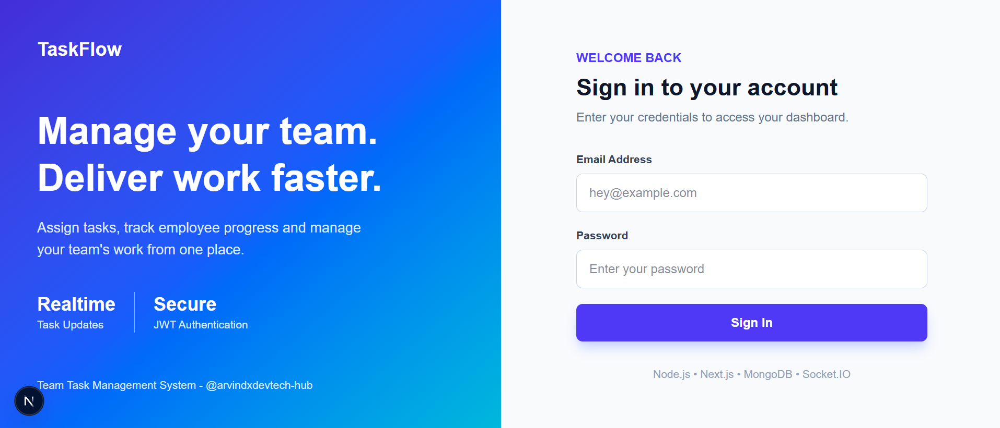

## Manager Dashboard

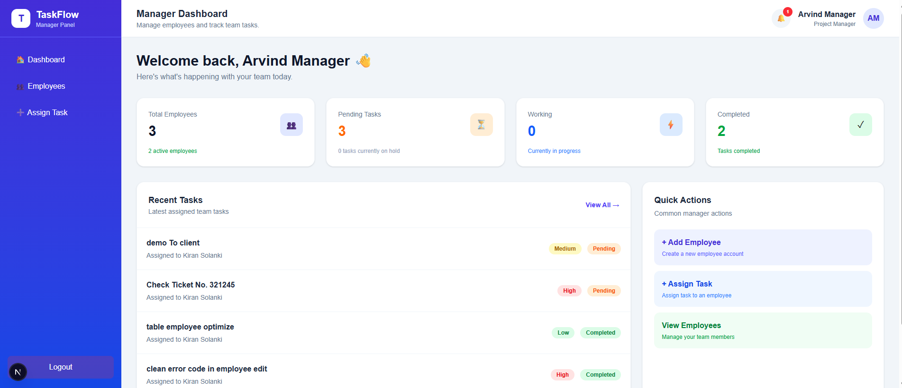

## Employee Management

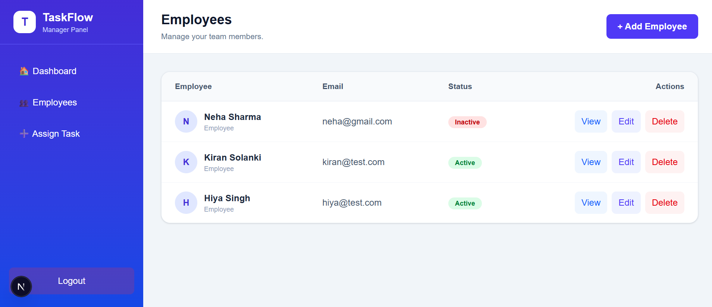

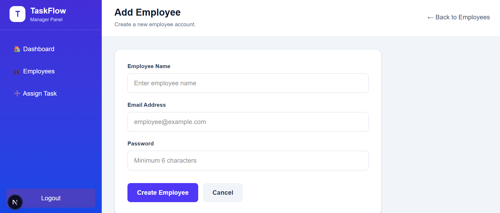

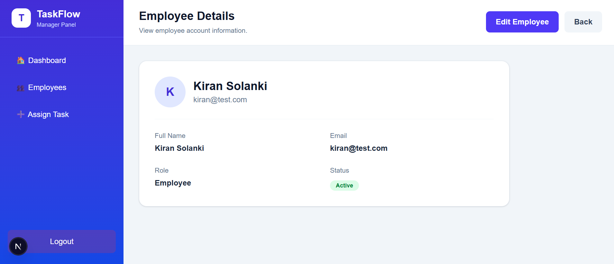

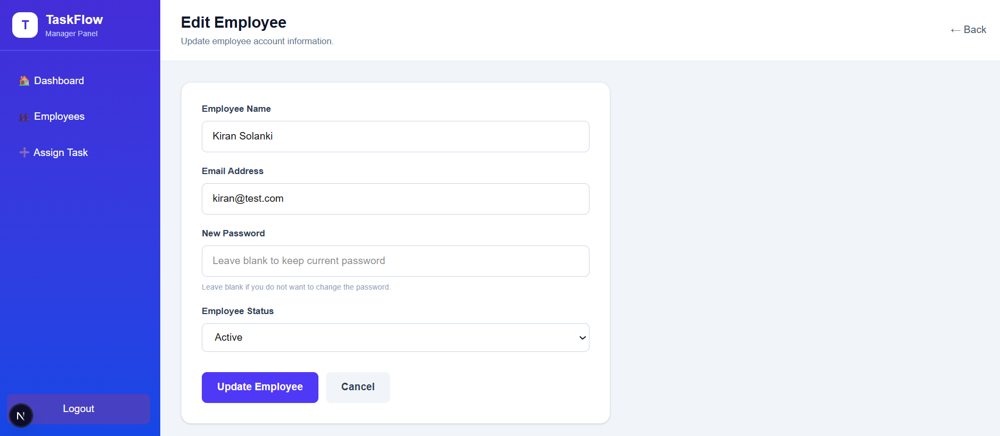

## Manager Task Management

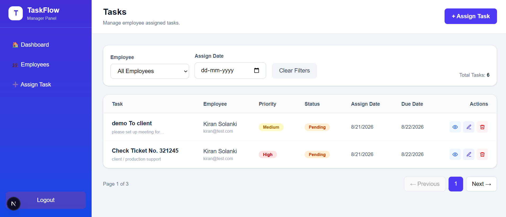

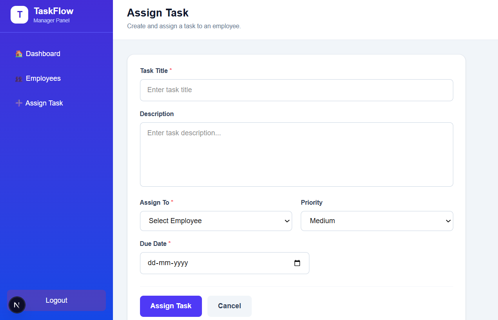

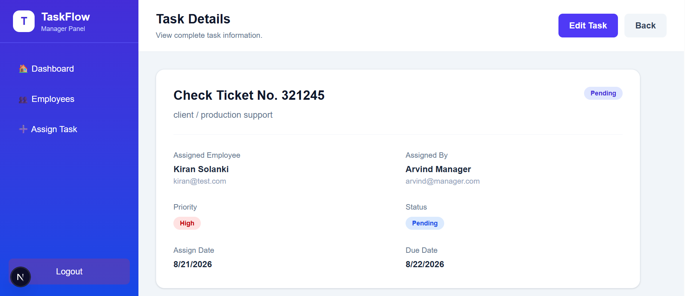

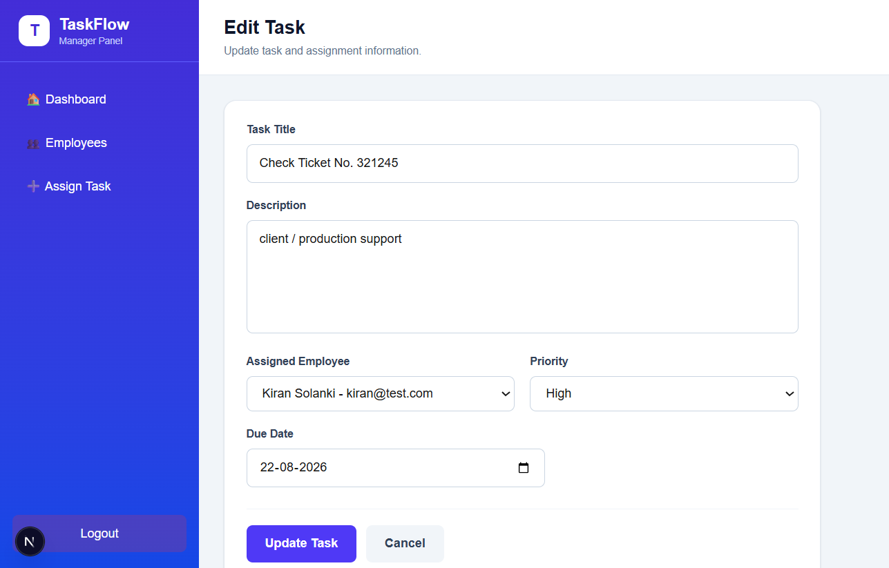

## Manager Notifications

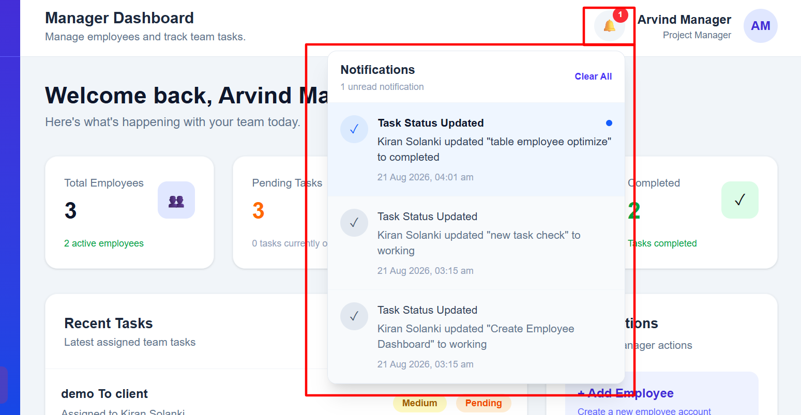

## Employee Dashboard

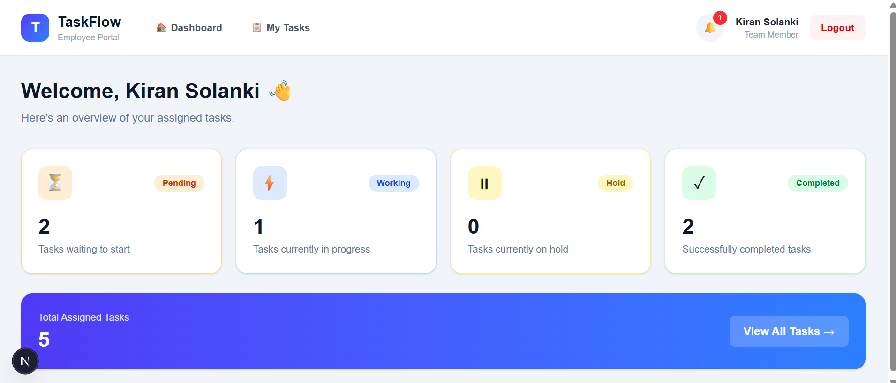

## Employee Tasks

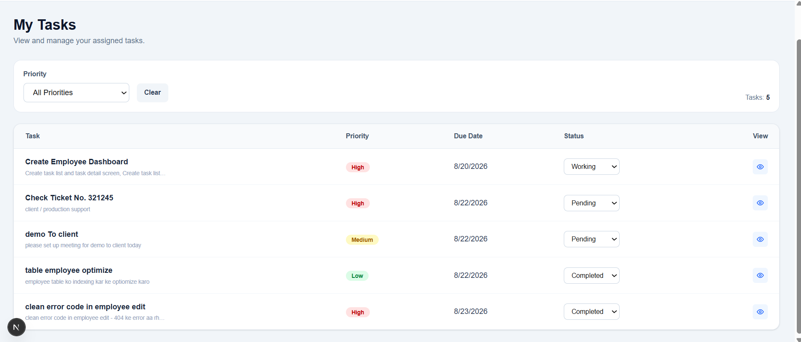


## Employee Notifications

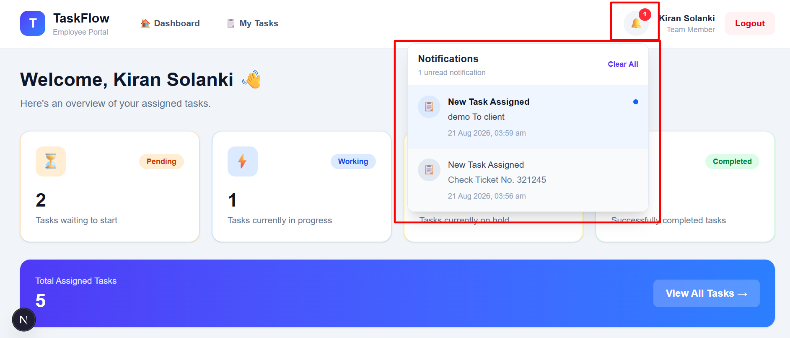

---

## Main Concepts Demonstrated

- Full-stack application architecture
- REST API integration
- JWT authentication
- Role-based authorization
- Employee CRUD
- Task CRUD and assignment
- MongoDB relationships with Mongoose
- Filtering and pagination
- React/Next.js state management
- Tailwind CSS UI
- Reusable confirmation modals
- Realtime Socket.IO rooms and events
- Realtime dashboard/task updates
- Toast notifications
- Read/unread notification UI
- User-specific notification persistence

---

## Notes

- `.env` and `.env.local` should not be committed with production secrets.
- The project currently uses local MongoDB for development.
- Frontend notifications are persisted in browser `localStorage`.
- Realtime communication is handled through Socket.IO.
- This project is intended for learning, demonstration, and portfolio use.

---

## Author

**Arvind Singh Sisodia**  
Senior Full Stack Developer

## License

This project is available for learning and demonstration purposes.
