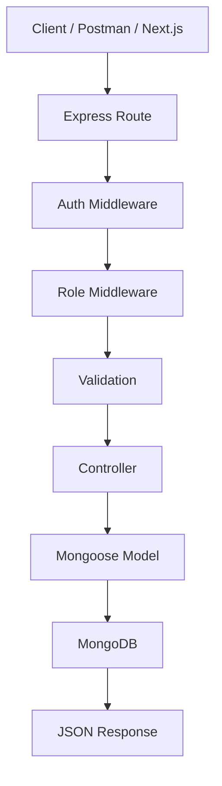
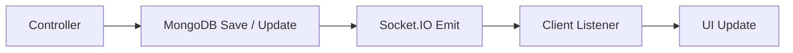
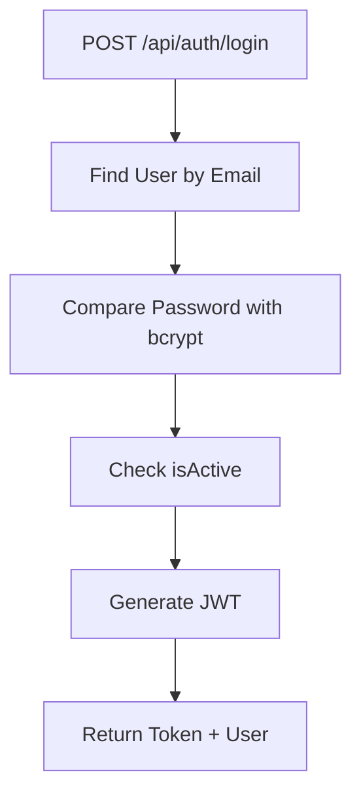
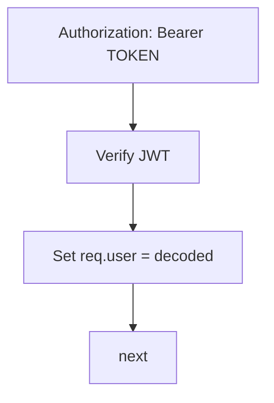
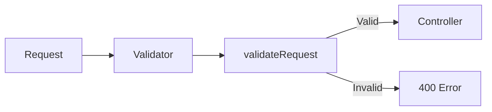
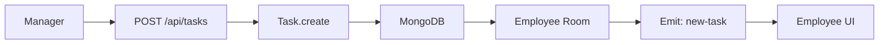
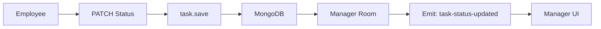
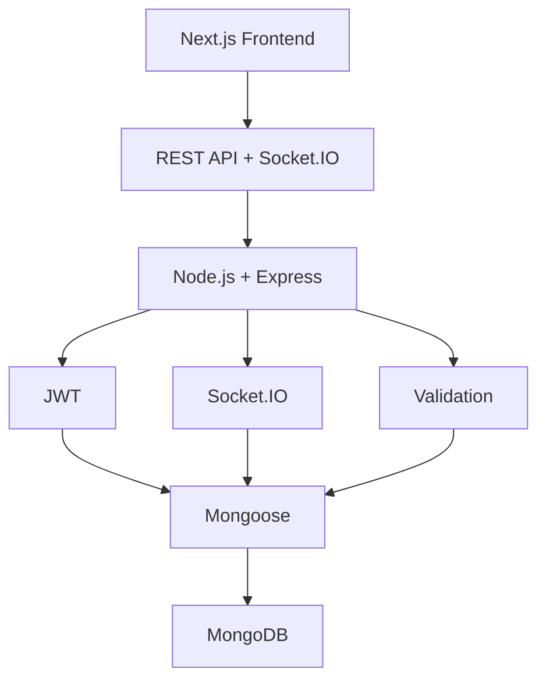

# Team Task Manager — Backend Learning Notes
A practical backend learning project using ****Node.js + Express.js + MongoDB + Mongoose + JWT + Socket.IO****.

## 1. Project Overview
****Project:**** `team-task-manager`

****Stack:**** Node.js, Express.js, MongoDB, Mongoose, JWT, bcryptjs, express-validator, dotenv, cors, Socket.IO, Nodemon.

****Roles:**** `manager`, `employee`

```text
Manager Login → JWT → Employee CRUD → Task Create/Assign → MongoDB
                                         ↓
                                   Socket.IO new-task
                                         ↓
                                      Employee
Employee Login → JWT → My Tasks → Task Detail → Status Update → MongoDB
                                                   ↓
                                      Socket.IO task-status-updated
                                                   ↓
                                                Manager
```
---


## Table of Contents

- [Project Overview](#1-project-overview)
- [Installation](#2-installation)
- [Environment](#3-environment)
- [Folder Structure](#4-folder-structure)
- [Main Request Flow](#5-main-request-flow)
- [Node / Express Concepts](#6-important-node--express-concepts)
- [MongoDB vs MySQL](#7-mongodb-vs-mysql)
- [Mongoose CRUD](#8-mongoose-crud-methods)
- [Login / JWT](#11-login--jwt-flow)
- [Socket.IO](#14-socketio-core)
- [API URLs](#18-api-urls)
- [Security](#20-security-points)
- [Debugging Notes](#20b-important-debugging--learning-fixes)
- [Quick Revision](#22-quick-revision)
- [Final Architecture](#23-final-architecture)

---
## 2. Installation
```bash
mkdir team-task-manager
cd team-task-manager
npm init -y
npm install express mongoose dotenv bcryptjs jsonwebtoken express-validator cors socket.io
npm install --save-dev nodemon
```

| Package | Use |

|---|---|

| express | REST API / backend routes |

| mongoose | MongoDB ODM |

| dotenv | `.env` variables load |

| bcryptjs | Password hashing |

| jsonwebtoken | JWT generate / verify |

| express-validator | Request validation |

| cors | Frontend access |

| socket.io | Realtime communication |

| nodemon | Auto restart in development |

`package.json`:

```json
{
  "type": "module",
  "scripts": {
    "start": "node index.js",
    "dev": "nodemon index.js"
  }
}
```

Run:

```bash
npm run dev
```
---
## 3. Environment
`.env`

```env
PORT=3000
MONGODB_URI=mongodb://127.0.0.1:27017/team_task_manager
JWT_SECRET=change_this_secret_for_learning
JWT_EXPIRES_IN=1d
```

`.gitignore`

```gitignore
node_modules/
.env
```
---
## 4. Folder Structure
```text
team-task-manager/
│
├── src/
│   ├── config/
│   │   └── database.js
│   ├── controllers/
│   │   ├── authController.js
│   │   ├── employeeController.js
│   │   ├── taskController.js
│   │   └── employeeTaskController.js
│   ├── middleware/
│   │   ├── authMiddleware.js
│   │   ├── managerMiddleware.js
│   │   ├── employeeMiddleware.js
│   │   ├── validationMiddleware.js
│   │   └── errorMiddleware.js
│   ├── models/
│   │   ├── User.js
│   │   └── Task.js
│   ├── routes/
│   │   ├── authRoutes.js
│   │   ├── employeeRoutes.js
│   │   ├── taskRoutes.js
│   │   └── employeeTaskRoutes.js
│   ├── validators/
│   │   ├── employeeValidator.js
│   │   └── taskValidator.js
│   └── seed/
│       └── managerSeeder.js
│
├── index.js
├── .env
├── .gitignore
├── package.json
└── package-lock.json
```
---
## 5. Main Request Flow



### Realtime Flow


---
## 6. Important Node / Express Concepts
### async / await
```js
const user = await User.findOne({ email });
const tasks = await Task.find();
await task.save();
```

- `async` → function Promise return karta hai.

- `await` → Promise result ka wait karta hai.

- Poora Node server block nahi hota.

### Express methods

| Method | Purpose |

|---|---|

| `app.use()` | Middleware/router mount |

| `router.get()` | GET request |

| `router.post()` | POST request |

| `router.put()` | Update |

| `router.patch()` | Partial/specific update |

| `router.delete()` | Delete |

| `req.body` | Request JSON body |

| `req.params.id` | URL ID |

| `req.headers` | Request headers |

| `res.status()` | HTTP status |

| `res.json()` | JSON response |

| `next()` | Next middleware/controller |

| `next(error)` | Error handler |

---
## 7. MongoDB vs MySQL

| MySQL | MongoDB |

|---|---|

| Database | Database |

| Table | Collection |

| Row | Document |

| Column | Field |

| `id` | `_id` |

| JOIN | `populate()` / `$lookup` |

| Foreign key | ObjectId reference |

---
## 8. Mongoose CRUD Methods
### Create
```js
const task = await Task.create({
  title,
  assignedTo,
  assignedBy
});
```

### Read all
```js
const tasks = await Task.find();
```

### Filter
```js
const tasks = await Task.find({
  assignedTo: req.user.id
});
```

### Find one
```js
const user = await User.findOne({ email });
```

### Find by ID
```js
const task = await Task.findById(req.params.id);
```

### Update
```js
const task = await Task.findByIdAndUpdate(
  req.params.id,
  req.body,
  {
    new: true,
    runValidators: true
  }
);
```

`new: true` → updated record return.

`runValidators: true` → schema validation update par apply.

### Save existing document
```js
task.status = "working";
await task.save();
```

### Delete
```js
await Task.findByIdAndDelete(req.params.id);
```
---
## 9. populate()
Task model reference:

```js
assignedTo: {
  type: mongoose.Schema.Types.ObjectId,
  ref: "User"
}
```

Query:

```js
const tasks = await Task.find()
  .populate("assignedTo", "name email")
  .populate("assignedBy", "name email");
```

Without populate:

```json
{ "assignedTo": "6a7eff0fcf346a6db9fd2001" }
```

With populate:

```json
{
  "assignedTo": {
    "_id": "6a7eff0fcf346a6db9fd2001",
    "name": "Kiran Solanki",
    "email": "kiran@test.com"
  }
}
```

MySQL concept: JOIN.
---
## 10. Models
### User fields
```text
name
email
password
role = manager / employee
isActive
createdAt
updatedAt
```

### Task fields
```text
title
description
assignedTo
assignedBy
priority = high / medium / low
status = pending / working / hold / completed
assignDate
dueDate
createdAt
updatedAt
```
---
## 11. Login / JWT Flow



JWT payload:

```js
{
  id: user._id,
  role: user.role
}
```

Auth middleware:


---
## 12. Role Authorization
Manager:

```js
if (req.user.role !== "manager") {
  return res.status(403).json({ message: "Manager access only" });
}
```

Employee:

```js
if (req.user.role !== "employee") {
  return res.status(403).json({ message: "Employee access only" });
}
```
---
## 13. Validation Flow



Example:

```js
body("priority")
  .optional()
  .isIn(["high", "medium", "low"]);
```
---
## 14. Socket.IO Core
Simple rule:

```text
Sender   = emit()
Receiver = on()
```

Frontend → Server:

```js
socket.emit("join-employee", employeeId);
```

```js
socket.on("join-employee", (employeeId) => {
  // receive
});
```

Server → Frontend:

```js
io.to(room).emit("new-task", task);
```

```js
socket.on("new-task", (task) => {
  // receive
});
```
---
## 15. Socket.IO Rooms
Employee room:

```js
const roomName = `employee_${employeeId}`;
socket.join(roomName);
```

Manager room:

```js
const roomName = `manager_${managerId}`;
socket.join(roomName);
```

Purpose: event sabko nahi, required user ko bhejna.
---
## 16. Realtime Task Assignment



Controller:

```js
const io = req.app.get("io");
const employeeRoom = `employee_${assignedTo}`;
io.to(employeeRoom).emit("new-task", {
  message: "New task assigned",
  task
});
```
---
## 17. Realtime Status Update



```js
const io = req.app.get("io");
const managerRoom = `manager_${task.assignedBy}`;
io.to(managerRoom).emit("task-status-updated", {
  taskId: task._id,
  employeeId: req.user.id,
  status: task.status
});
```
---
## 18. API URLs
Base URL:

```text
http://localhost:3000
```

### Auth

| Method | URL | Purpose |

|---|---|---|

| POST | `/api/auth/login` | Manager / Employee login |

### Employee Management — Manager Only

| Method | URL | Purpose |

|---|---|---|

| POST | `/api/employees` | Create employee |

| GET | `/api/employees` | Employee list |

| GET | `/api/employees/:id` | Employee detail |

| PUT | `/api/employees/:id` | Update employee |

| DELETE | `/api/employees/:id` | Delete employee |

### Task Management — Manager Only

| Method | URL | Purpose |

|---|---|---|

| POST | `/api/tasks` | Create + assign task |

| GET | `/api/tasks` | All tasks |

| GET | `/api/tasks/:id` | Single task |

| PUT | `/api/tasks/:id` | Update / reassign |

| DELETE | `/api/tasks/:id` | Delete task |

### Employee Task APIs

| Method | URL | Purpose |

|---|---|---|

| GET | `/api/employee/tasks` | Logged-in employee tasks |

| GET | `/api/employee/tasks/:id` | Single assigned task |

| PATCH | `/api/employee/tasks/:id/status` | Update task status |

---
## 19. Common HTTP Status Codes

| Code | Meaning |

|---|---|

| 200 | Success |

| 201 | Created |

| 400 | Validation / bad request |

| 401 | Unauthorized |

| 403 | Forbidden |

| 404 | Not found |

| 409 | Conflict |

| 500 | Server error |

---
## 20. Security Points
- Password plain text me save nahi karna.

- `bcrypt.hash()` use karna.

- Password API response me return nahi karna.

- `.env` GitHub par push nahi karna.

- JWT middleware lagana.

- Role authorization lagana.

- Employee create request se `role` accept nahi karna.

- Employee sirf apne assigned tasks access kare.

- Employee sirf apne task ka status update kare.
---
## 20A. Task Filtering + Pagination
Manager task list supports query parameters such as:

```text
GET /api/tasks?page=1&limit=10
GET /api/tasks?page=1&limit=10&employeeId=EMPLOYEE_ID
GET /api/tasks?page=1&limit=10&date=2026-08-21
```

Core concepts:

```js
const page = parseInt(req.query.page) || 1;
const limit = parseInt(req.query.limit) || 10;
const skip = (page - 1) * limit;
const filter = {};
if (req.query.employeeId) {
  filter.assignedTo = req.query.employeeId;
}
const tasks = await Task.find(filter)
  .populate("assignedTo", "name email isActive")
  .populate("assignedBy", "name email")
  .sort({ createdAt: -1 })
  .skip(skip)
  .limit(limit);
const totalTasks = await Task.countDocuments(filter);
const totalPages = Math.ceil(totalTasks / limit);
```

`req.query` → URL query parameters read karta hai.

`skip()` + `limit()` → MongoDB pagination.
---
## 20B. Important Debugging / Learning Fixes
- Frontend `PATCH` aur backend `PUT` mismatch hone par route `404` mila. Final employee status route `PATCH /api/employee/tasks/:id/status` hai.

- `Unexpected token '<'` ka reason tha ki frontend `response.json()` expect kar raha tha, lekin wrong/missing route se HTML 404 response aa raha tha.

- `User is not defined` fix: `employeeTaskController.js` me `User` model import karna zaruri tha before `User.findById(...)`.

- Socket event payload backend/frontend me same shape hona chahiye. Backend direct `{ taskId, employeeId, status }` bhej raha ho to frontend me `data.status` use hoga, `data.task.status` nahi.

- Manager ke paas multiple employees hote hain, isliye realtime status event me `employeeName`, `employeeEmail`, `title`, `taskId`, `status` bhejna useful hai.

- Shared frontend socket ko child page cleanup me `socket.disconnect()` karne se other listeners break ho sakte hain. Prefer exact `socket.off(event, handler)` cleanup.
---
## 20C. Backend vs Socket.IO Responsibility
```text
REST API
→ MongoDB create/update/delete
→ persistent data
Socket.IO
→ realtime notification
→ realtime UI synchronization
→ dashboard count refresh
→ task list refresh/update
```

Socket.IO database ka replacement nahi hai.
---
## 20D. Frontend Notification Persistence Note
Current notifications frontend `localStorage` me persist hoti hain.

Employee-specific keys:

```text
employee_notifications_<employeeId>
```

Multiple managers support karne ho to manager-side key bhi user-specific rakhna better hai:

```text
manager_notifications_<managerId>
```

Ye frontend persistence hai. Multiple devices/browsers me permanent notification history chahiye ho to future me MongoDB `notifications` collection add ki ja sakti hai.
---
## 21. Current Backend Progress
```text
Node.js / Express          ✅
MongoDB / Mongoose         ✅
Manager Login              ✅
Employee Login             ✅
JWT Authentication         ✅
Role Authorization         ✅
Employee CRUD              ✅
Task CRUD                  ✅
Task Assignment            ✅
Employee My Tasks          ✅
Employee Task Detail       ✅
Employee Status Update     ✅
Socket.IO Server           ✅
Socket Rooms               ✅
Realtime New Task Event    ✅
Realtime Status Event      ✅
```
---
## 22. Quick Revision
- ****Node.js**** → JavaScript runtime for server-side code

- ****Express.js**** → Node.js web/API framework

- ****MongoDB**** → NoSQL document database

- ****Mongoose**** → MongoDB ODM

- ****JWT**** → Authentication token

- ****bcryptjs**** → Password hashing

- ****dotenv**** → `.env` loader

- ****Nodemon**** → Auto restart dev server

- ****express-validator**** → Request validation

- ****Socket.IO**** → Realtime communication

- ****emit()**** → Send event

- ****on()**** → Receive/listen event

- ****populate()**** → Referenced document details fetch

- ****async/await**** → Promise based async operations

- ****middleware**** → Request aur controller ke beech processing layer
---
## 23. Final Architecture


